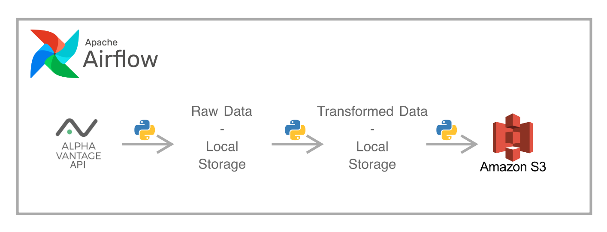

# Investment Banking Data Pipeline

## Goal

The pipeline aims to provide quarterly reports and weekly stock data about top investment banks that could be later used for dashboarding and other analytical usecases.

Data is first extracted from the Alpha Vantage API with Python and then stored locally. After some data validation, the unstructured JSON data is transformed into a structured CSV, which is then uploaded to Amazon S3. Upon successful loading, the raw and transformed data are deleted from the local storage. The data pipeline is orchestrated by Apache Airflow; the DAGs run on a weekly and quarterly basis.

## The architecture


## How to run the project

1. Create a Python virtual environment
```
  python3 -m venv venv
  source venv/bin/activate
```
2. Install the below Python libraries:
```
    - boto3
    - dotenv
    - airflow
    - psycopg2
    - python-dotenv
```
by running:
```
pip3 install -r requirements.txt
```
3. Instead of SQLite, use Postgres as a meta-database for Airflow\
https://airflow.apache.org/docs/apache-airflow/stable/howto/set-up-database.html#setting-up-a-postgresql-database

4. Create an S3 bucket in AWS\
https://docs.aws.amazon.com/AmazonS3/latest/userguide/creating-bucket.html

5. Create a .env file, to store credentials for Amazon S3 and the Alpha Vantage API key:
```
  AWS_ACCESS_KEY_ID=your access key
  AWS_SECRET_ACCESS_KEY=your secret access key
  AWS_REGION=your AWS region
  BUCKET=your bucket name
  AV_KEY=your API key
```
6. After setting the home directory for Airflow, run the scheduler and the webserver
```
  export AIRFLOW_HOME=$(pwd) 
```
```
  airflow scheduler
```
```
  airflow webserver
```
7. Trigger the DAGs through the Airflow UI

## Next phases:

  - The data from Amazon S3 will be copied to Amazon Redshift, where it will be possible do further transformations using dbt to achieve the desired output tables.
  - The project will be containerized with Docker.
