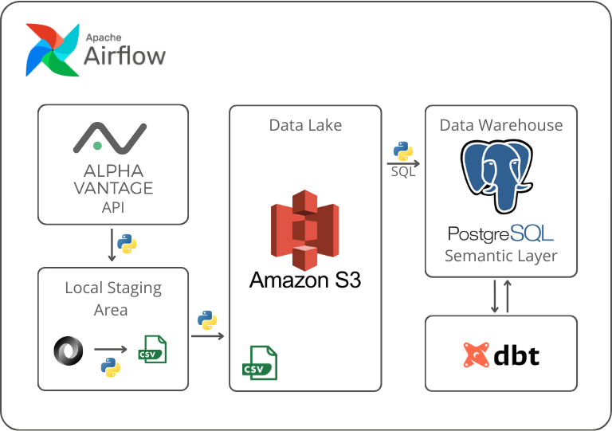

# Investment Banking Data Pipeline

## Goal

The pipeline aims to provide quarterly reports and weekly stock data about top investment banks that could be later used for dashboarding and other analytical usecases.

Data is first extracted from the Alpha Vantage API with Python and then stored locally. After some data validation, the unstructured JSON data is transformed into a structured CSV, which is then uploaded to Amazon S3. Upon successful loading, the raw and transformed data are deleted from the local storage. After these steps, a new process loads the data from the Amazon S3 Data Lake to a Postgres Data Warehouse. A separate schema in the Data Warehouse, named as ```analytics``` acts as the semantic layer, where models can be utilized with the use of dbt. The data pipeline is orchestrated by Apache Airflow; the DAGs run on a weekly and quarterly basis.

## The architecture


## How to run the project
1. Clone the repository
```
  git clone https://github.com/vincesiposgaudi/ib_pipeline.git
  cd ib_pipeline
```
2. Create a Python virtual environment
```
  python3 -m venv venv
  source venv/bin/activate
```
3. Install the below Python libraries:
```
  - boto3
  - dotenv
  - psycopg2
  - dbt-postgres
  - python-dotenv
  - apache-airflow
  - apache-airflow-providers-amazon
  - apache-airflow-providers-postgres
```
by running:
```
pip3 install -r requirements.txt
```
4. Instead of SQLite, use Postgres as a meta-database for Airflow\
https://airflow.apache.org/docs/apache-airflow/stable/howto/set-up-database.html#setting-up-a-postgresql-database

5. Create an S3 bucket in AWS to be used as a Data Lake\
https://docs.aws.amazon.com/AmazonS3/latest/userguide/creating-bucket.html

6. Create a Postgres database named as ```dwh``` and a schema named as ```finance``` in it\
https://www.postgresql.org/docs/current/manage-ag-createdb.html
   
7. Create the connection named as ```postgres``` to the Postgres Data Warehouse through the Airflow UI\
https://airflow.apache.org/docs/apache-airflow/stable/howto/connection.html

8. Request a free API key from Alpha Vantage:
https://www.alphavantage.co/support/#api-key

9. Create a .env file, to store credentials for Amazon S3 and the Alpha Vantage API key:
```
  AWS_ACCESS_KEY_ID=your access key
  AWS_SECRET_ACCESS_KEY=your secret access key
  AWS_REGION=your AWS region
  BUCKET=your bucket name
  AV_KEY=your API key
  AIRFLOW__DATABASE__SQL_ALCHEMY_CONN=your postgres connection for the airflow meta-database
```
10. Run the startup script to set variables and run the scheduler and the webserver
```
  ./startup.sh
```
11. Trigger the DAGs through the Airflow UI

## Next phases:

  - The project will be containerized with Docker.
